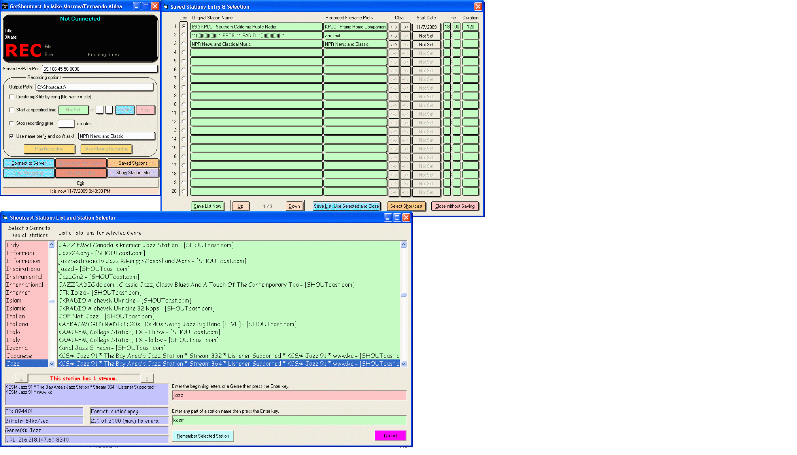



## Shoutcast Ripper with Presets and Timed Start/Stop v3\.0

### Description

This program multiply (sequentially) records on time from Shoutcast streams. It can receive only, receive and record manually or record automatically by time. Now fully TeeVoh'd (sic). It can play the recorded file via a WMP imbedded control. It has a LOT of station preset memories for quick tuning.

Version 3.0 is a fixup release with full TeeVoh and many small tweaks I found while using this program.

Version 3.1 fixes up some small things that were still messy and adds a reboot or shutdown after recording option. I added this since my main XP machine does not want to operate more than 24 hours without a reboot. $tupid Windows.

It will record and play .aac files to support all Shoutcast streams. You must get a codec to enable this. See the README.TXT for the simple directions for downloading and installing the codec. Free and easy and it works great.

There are several text files including operation and error message. One point I want to repeat here -- the reason it has to be totally automatic is to know whether to record .mp3 or .aac format streams and what to make the filetype. There is still a small manual window which may cause you grief to use. I recommend full automatic operation. All stations should be selected from the station memory form to ensure the proper filetype for recording. I should shut that window, the draft is too cold!

Also, in the included text files are thanks to those whose code I used to improve this program.

Thanks to all posters.

This is an update of the Shoutcast Ripper by Fernando Aldea which is on P-S-C. It has a Winamp problem that I have not been able to cure, does not have timed recording, ignores .aac so the recordings are useless or station memory but does have the core communication code which worked fairly well to cause Shoutcast data to come down, be able to be recorded and to save the stream by song title. Of course, this is a little dodgy if the stream cross-fades songs. Makes the beginning start late and tails messy with the cross-fade. Also, since the "metaint" (with the new song title) packet only comes occasionally, it is further delayed causing a problem. This is not recommended for cross-fade channels.

Complete, recurring record based on day of the week is now possible. If the same show repeats on many days of the week, you must include one entry for each day. Sorry. I never planned for a multiple schedule that but just found it is needed for the week daily WBGO Blues hour. I may change that some day but it will require a rewiring of the program since it is a single recording/stream program right now. Also, it may never happen! Further, it can only record one stream at a time but you can run multiple instances of the program to record overlapping schedules. That will probably never change either. If you do so, remember to close the one last that you added any stations to or the other one will write the old version without the new stations.

Thanks to all posters!! Without you, this project would never have even been started. Never mind finishing it!!
 
### More Info
 
Inputs: See code.

Side Effect: Happiness

             |
---                |---
**Submitted On**   |2009-12-26 21:10:10
**By**             |[Mike Morrow](https://github.com/Planet-Source-Code/PSCIndex/blob/master/ByAuthor/mike-morrow.md)
**Level**          |Intermediate
**User Rating**    |5.0 (10 globes from 2 users)
**Compatibility**  |VB 6\.0
**Category**       |[Complete Applications](https://github.com/Planet-Source-Code/PSCIndex/blob/master/ByCategory/complete-applications__1-27.md)
**World**          |[Visual Basic](https://github.com/Planet-Source-Code/PSCIndex/blob/master/ByWorld/visual-basic.md)
**Archive File**   |[Shoutcast\_21712512272009\.zip](https://github.com/Planet-Source-Code/mike-morrow-shoutcast-ripper-with-presets-and-timed-start-stop-v3-0__1-72584/archive/master.zip)

### API Declarations

API/Globals, see the code.

